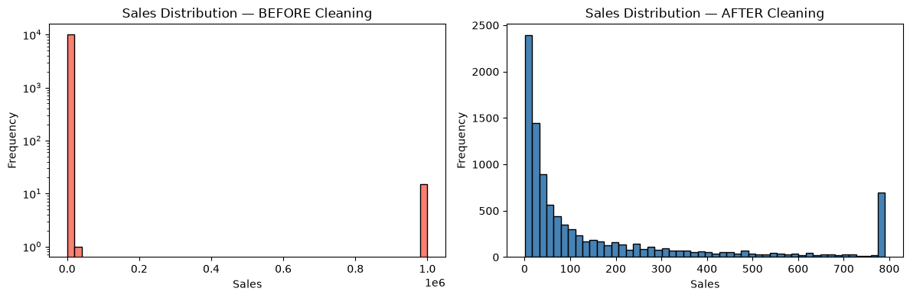

# Task 06 — Data Cleaning, Transformation & ETL

**Tool:** Jupyter Notebook (Python, Pandas, NumPy)
**Dataset:** Sample Superstore (with realistic quality issues)
**Approach:** Repeatable ETL pipeline (Extract → Transform → Load)

## Deliverables

- `Task06_Data_Cleaning_ETL.ipynb` — Full analysis notebook
- `etl_pipeline.py` — Reusable Python script
- `Superstore_Clean.csv` — Cleaned output data
- `SampleSuperstore.csv` — Raw input data
- `before_after_sales.png` — Visual proof of outlier handling
- `screenshots/` — 5 key result screenshots

## Data Quality Issues Addressed

- Duplicate rows: 50 (all columns)
- Missing values: 350 (Postal Code, Profit, Discount)
- Inconsistent categories: 180 (Category)
- Whitespace padding: All rows (Segment, Category, etc.)
- Wrong data type: 40 (Sales with $ symbols)
- Outliers: 15 (Sales set to 999999)

## Cleaning Steps Applied

1. Removed duplicates — 50 rows dropped
2. Trimmed whitespace — 10 text columns normalized
3. Standardized categories — "furniture", "FURNITURE", "Furnitur" → "Furniture"
4. Fixed Sales type — stripped $ symbols, converted to float64
5. Fixed dates — DD-MM-YYYY text → datetime
6. Handled nulls — Postal Code → 0; Profit → median; Discount → 0; Sales nulls dropped
7. Capped outliers — Sales capped at Q3 + 3×IQR (upper bound ≈ 790.60)

## Repeatable ETL Workflow

The pipeline is modular, so it can be re-run on fresh data:

- `extract(filepath)` — loads CSV
- `transform(df)` — applies all cleaning steps
- `load(df, output_path)` — saves cleaned data

Run the pipeline:

    python etl_pipeline.py

## Results — Before vs After

- Rows: 10,044 → 9,979
- Columns: 21 → 21
- Duplicates: 50 → 0
- Null values: 350 → 0
- Categories: 6 unique → 3 unique
- Sales dtype: object → float64
- Max Sales: 999,999 → 790.60

## Visual Proof

The left histogram shows the raw data with extreme outliers (log scale required).
The right shows the cleaned data after IQR-based capping.

## Key Learnings

- Reproducible pipelines beat ad-hoc cleaning. Wrapping steps in functions means the same logic runs on any future dataset.
- IQR-based capping preserves more data than row removal.
- Median imputation is safer than mean for skewed distributions like Profit.
- Standardizing categorical values matters — without it, groupby would return 6 categories instead of 3.
- Always diagnose before cleaning. Running `df.isnull().sum()` and `df.duplicated().sum()` first tells you exactly what needs fixing.
